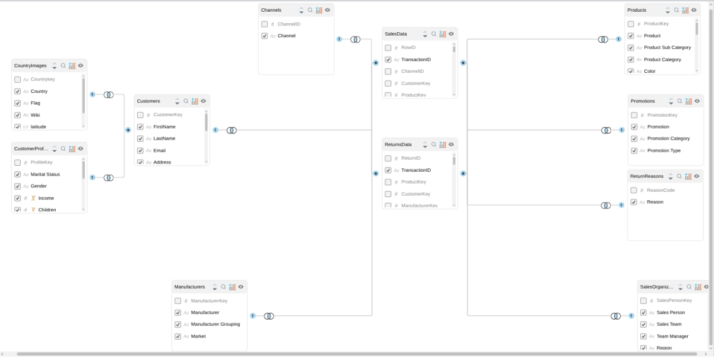
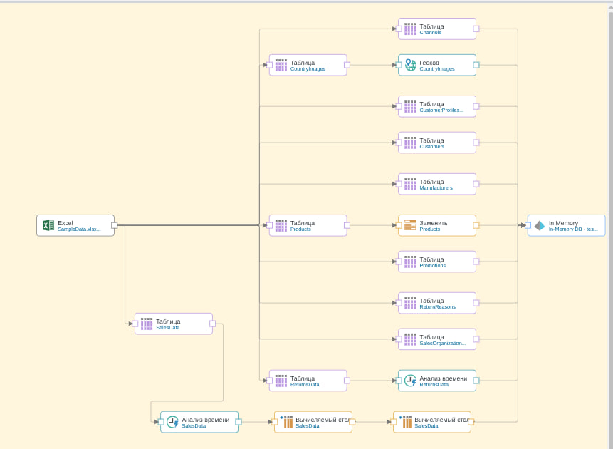
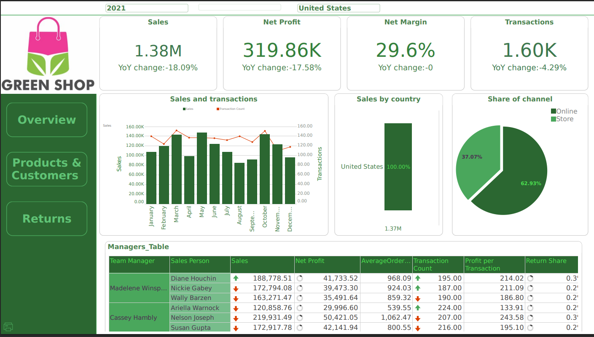
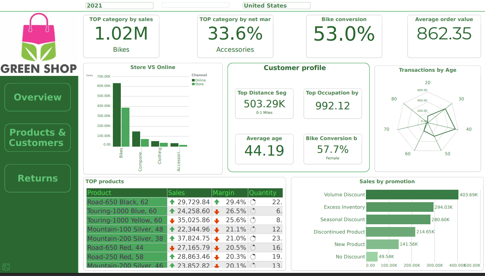
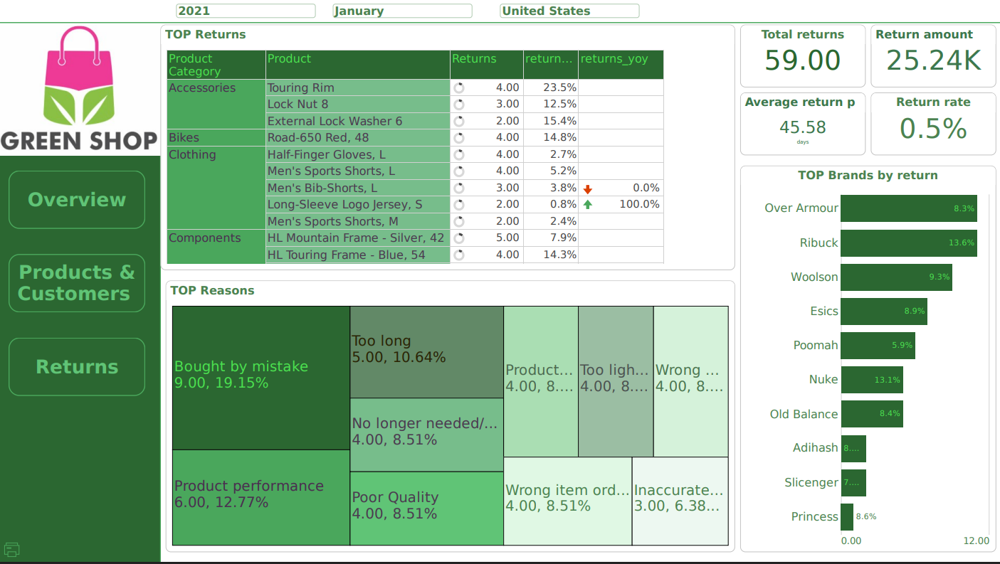

# BI-Dashboard - Sales-Analytics
# 📊 Sales Analytics Dashboard — Pyramid Analytics

Аналитический дашборд на основе данных розничных продаж велосипедов и аксессуаров. Реализован полный цикл BI-разработки: проектирование модели данных, ETL-пайплайн и три страницы интерактивной отчётности.

## 🎯 Бизнес-задача

Данные содержат информацию о продажах и возвратах розничного магазина за 2019–2021 годы. Дашборд отвечает на три управленческих вопроса:

1. **Как работает бизнес в целом?** — динамика продаж, прибыльность, эффективность команды
2. **Что и кому продаём?** — анализ продуктов, каналов и сегментов клиентов
3. **Где теряем деньги после продажи?** — анализ возвратов по причинам, брендам и продуктам

---

## 🗃 Источник данных

Excel-файл с 11 таблицами:

| Таблица | Описание | Тип |
|---|---|---|
| SalesData | Транзакции продаж | Факты |
| ReturnsData | Возвраты товаров | Факты |
| Products | Каталог продуктов с иерархией Category→SubCategory→Product | Измерение |
| Customers | База клиентов с географией | Измерение |
| CustomerProfiles | Демографические профили клиентов | Измерение |
| Manufacturers | Производители с группировкой | Измерение |
| SalesOrganization | Иерархия команды продаж | Измерение |
| Promotions | Типы промоакций | Измерение |
| Channels | Каналы продаж (Store / Online) | Измерение |
| ReturnReasons | Причины возвратов | Измерение |
| CountryImages | Флаги стран | Справочник |

---

## 🏗 Архитектура модели данных

**Почему была выбрана Galaxy Schema:**
- SalesData и ReturnsData имеют разную гранулярность — объединение привело бы к дублированию строк и некорректным агрегациям
- Конформные измерения (Products, Customers, Manufacturers, Promotions) позволяют считать сквозные метрики — Return Rate и Return Share в разрезе любого измерения
---
## ⚙️ ETL Pipeline

Источник данных: Excel → Pyramid In-Memory DB

**Шаги обработки:**
1. Загрузка всех 11 таблиц из Excel
2. Применение **Time Intelligence** к SalesData и ReturnsData — автоматическое создание Year, Quarter, Month, Week
3. Вычисляемые столбцы в SalesData:
   - `GrossMargin = Round(([Sales] - [Cost]) / [Sales], 4)`
   - `ProfitPerUnit = Round([Net Profit] / [Quantity], 2)`
4. Замена значений в Products (узел Заменить)
5. Геокод для CountryImages
6. Загрузка в In-Memory DB

---

## 📈 Дашборд — три страницы

### Страница 1: Sales Overview

**Бизнес-вопрос:** как работает бизнес в целом?

**Компоненты:**
- 4 KPI карточки: Sales, Net Profit, Net Margin, Transactions — каждая с YoY change
- Комбо-график Sales + Transaction Count по месяцам (две оси)
- Sales by Country — горизонтальные бары
- Share of Channel — Store vs Online (пирог)
- Таблица менеджеров с метриками: Sales, Net Profit, Average Order Value, Transaction Count, Profit per Transaction, Return Share

---

### Страница 2: Products & Customers

**Бизнес-вопрос:** что и кому продаём?

**Компоненты:**
- 4 KPI: TOP category by Sales, TOP category by Net Margin, Bike Conversion Rate, Average Order Value
- Store vs Online по категориям продуктов — сгруппированные столбцы
- Customer Profile блок: Top Distance Segment, Top Occupation by Avg Order, Average Age, Bike Conversion by Gender
- TOP 10 продуктов — таблица с Sales, Margin, Quantity и YoY стрелками
- Sales by Promotion Type — горизонтальные бары
- Transactions by Age — радарный график

---

### Страница 3: Returns

**Бизнес-вопрос:** где теряем деньги после продажи?

**Компоненты:**
- 4 KPI: Total Returns, Return Amount, Average Return Period (days), Return Rate
- TOP Returns — таблица по категориям и продуктам с YoY по возвратам
- TOP Reasons — Treemap причин возвратов
- TOP Brands by Return — горизонтальные бары с процентом

**Почему Treemap для причин:**
10 категорий примерно одинакового размера — пирог с таким количеством секторов нечитаем. Treemap сохраняет визуальную пропорцию и читается за секунду.

---

## 🛠 Технологии

- **Pyramid Analytics** — BI платформа
- **Excel** — источник данных
- **In-Memory DB** — хранилище модели

---

## 📝 Что бы улучшил в следующей итерации

- Добавить bridge-таблицу между SalesData и ReturnsData через TransactionID для прямого сопоставления продаж и возвратов
